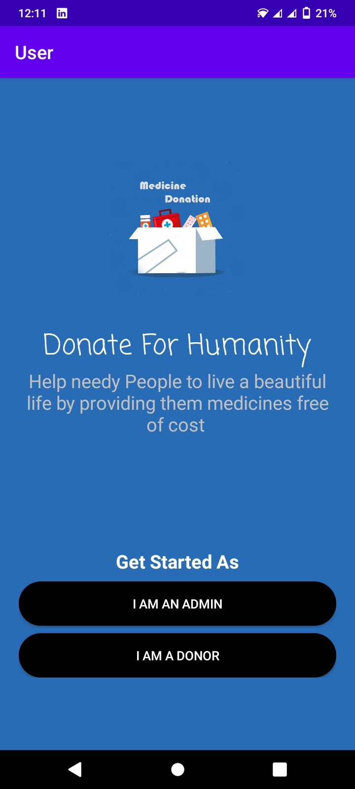

# medicine_donation_system_mnat_android
#android_development
#android_developer
#android_application
#android
#firebase_realtime_database_application
app for android github integration

    <h1>Project Interface</h1>

    <h2>1.Start/Splash Screen</h2>
     

    <h2>2.Slelect user type(admin or donor)</h2>
     

    <h2>2.Slelect user type(admin or donor)</h2>
     

